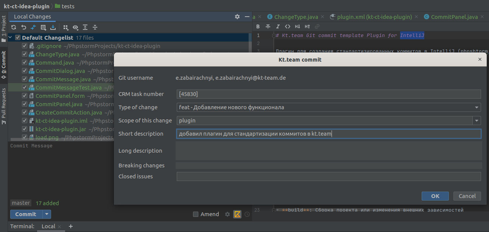

# Kt.team Git commit template Plugin for IntelliJ

Плагин для создания стандартизированных коммитов в IntelliJ (phpshtorm, idea) 
## Структура коммитов

Сообщения commit’ов должны быть следующей структуры:  
```bash
<type>(scope): [task] <description>

<optional body>

<optional footer>
```
- **type**: тип (выбираем из списка)
- **scope**: область (подставляется из последнего коммита, ред.)
- **task**: номер задачи (битрикс24) (подставляется из названия ветки, ред.)
- **description**: краткое описание изменений
- **body**: развёрнутое описание
- **footer**: дополнительное описание (meta)


## Типы коммитов (type)
- **build**: Сборка проекта или изменения внешних зависимостей
- **ci**: Настройка CI и работа со скриптами
- **docs**: Обновление документации
- **feat**: Добавление нового функционала
- **fix**: Исправление ошибок
- **perf**: Изменения направленные на улучшение производительности
- **refactor**: Правки кода без исправления ошибок или добавления новых функций
- **revert**: Откат на предыдущие коммиты
- **style**: Правки по кодстaйлу (табы, отступы, точки, запятые и т.д.)
- **chore**: Прочие изменения (не исходники и не тесты)
- **test**: Добавление тестов

## Примеры
```bash
feat(npm): [40433] add dependence express
docs(readme.md): [40686] change docs
```

## Установка
#### 1. Клонируем репозиторий
```
git clone https://github.com/evgeniizab/kt-ct-idea-plugin.git
```
#### 2. В IDE Settings->Plugins->install Plugin from Disk и прописываем путь к kt-ct-idea-plugin.jar 

#### 3. В окне коммита (VSC->Commit...) появляется конка с логотипом kt.team. Нажимаем на неё и появляется окно помощи для правильного описание коммита.

